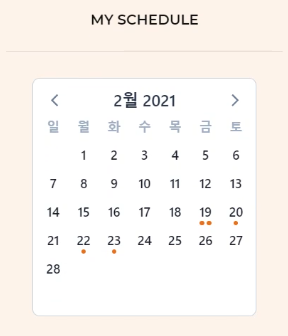

# DAZU_온라인 쿠킹 클래스
:cookie: 온라인 쿠킹 클래스 플랫폼 ‘DAZU’ 웹 서비스


## 기획의도

>  소상공인의 어려움 & 집콕생활 & 밀키트
>
> 코로나가 예상치 못하게 장기간 지속됨으로 소상공인은 많은 어려움을 겪고 있습니다.
>
> DAZU는 소상공인의 어려움을 집콕생활과 밀키트라는 트렌드를 융합하여 온라인 쿠킹클래스 개설을 통해 극복할 수있게 도와주는 서비스입니다. 

## 실행

#### Vue.js실행

1. 패키지 설치

``` bash
$ npm i
```

2. Vue.js 실행

```bash
$ npm run serve
```


## Project Construction &#128193;

```bash
📦PJT
 ┣ 📂Backend
 ┃ ┣ 📂
 ┣ 📂Frontend		# FrontEnd
 ┃ ┣ 📂vue-front 
 ┃ 	┣ 📂src				# Front 코드
 ┣ 📂참고자료		# 산출물
 ┃ ┣ 📂pjt01_DB				# DB 관련
 ┃ ┣ 📂pjt-1_wireframe		# 와이어프래임
 ┗ 📜README.md			# 프로젝트 README
```


## Tech Stack

 


## 기능

#### 기능 소개 UCC

:dvd: https://youtu.be/xYV-ExhAhAw

#### 로그인 및 회원가입

- **카카오 회원가입** 이용 (카카오 프로필 이미지, 닉네임 활용)
- 사장님, 고객님 나눠서 목적에 따라 회원가입 분리


#### 메인페이지

- 현재 위치에 등록된 클래스의 목록을 슬라이드 형태로 볼 수있다.
- 카카오맵을 활용하여 마커에 가게 위치뿐 아니라 가게에 등록왼 클래스 목록을 팝업으로 볼수 있게 구현하였다.


#### 클래스 리스트

- 클래스 탭을 누르면 등록된 클래스들이 카드 형태로 보이게 된다.
- 반응형으로 제작하였다


#### 클래스 디테일

- 탭을 통해 클래스, 가게, 밀키트 정보를 확인 할 수 있다.
- 달력을 통해 쉽게 요일별 개설된 


- 두개의 탭을 통해 클래스별 리뷰와 QnA를 할 수 있다.


- 오른쪽 사이드 바를 통해 달력을 통해 쉽게 날짜별 개설된 클래스 시간을 확인 할 수 있다,

- 밀키트 여부 또한 선택할 수 있고, 카카오결제가 성공하면 자동으로 클래스가 신청완료 된다.

  <div style="text-align:center"></div>

#### 마이페이지(고객님)

- 회원가입시 등록된 정보가 나타난다.

- 주소가 변경되면 마이페이지에서 자신의 주소를 수정 할 수 있다.

  

- 달력을 통해 신청한 클래스의 스케쥴을 한눈에 볼수 있다.

- 리스트 형태로 등록된 클래스가 열리면 바로 수업을 들을 수 있는 버튼이 있다.

  <div style="text-align:center"></div>

#### 마이페이지(사장님)

- 사장님은 자신의 쿠킹 클래스를 등록 및 관리 할수 있는 "나의 가게 바로가기" 버튼을 볼 수 있다.

  

  

- 하단의 '클래스등록' 버튼을 통해 클래스를 새로운 클래스를 등록할 수 있다,

- 클래스 이름,가격, 수강인원,시간,난이도,음식 분류를 입력한다.

- 클래스 썸네일, 클래스 상세설명은 **이미지**로 등록한다.

  

- '밀키트 등록' 버튼을 통해 밀키트가 필요한 클래스인 경우 추가 정보를 입력한다.

  

#### 커뮤니티

- 클래스 등록 뿐 아니라 동네 활성화를 위해 꿀집공유/맛집공유 할 수 있는 커뮤니티  사이트가 있다.
- 각 커뮤니티마다 상단 Top10을 나타내준다. 


- 게시물을 클릭하면 게시물에 댓글을 달 수 있다.


## :pencil:ERD


